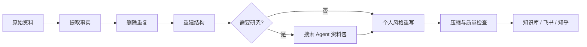

<div align="center">

# 知识库架构大师

<p><strong>把 AI 长文和零散资料，整理成真正属于你的知识库</strong></p>

[](https://agentskills.io/specification)
[](https://github.com/XiaoSiKe/knowledge-base-architect)
[](https://github.com/XiaoSiKe/knowledge-base-architect/actions/workflows/validate.yml)
[](LICENSE)
[](README.md)

**个人风格优先 · 先认知后实战 · 专业但不啰嗦 · 可以直接使用**

</div>

---

## 它解决什么问题？

AI 往往给出一篇“很完整但不想保存”的长文：重复、松散、像百科，也不像自己。

知识库架构大师会把原始资料重新整理为：

- 小白可以看懂的解释
- 由浅入深的知识结构
- 可以直接执行的步骤
- 可复制给 AI 的自然语言提示词
- 必要的安全提醒
- 方便复习的速查和核心句

> 外部方法只增强专业性。最终的取舍、结构和语气始终服从你的个人风格。

## 核心工作流



## 三种模式

| 模式 | 用途 |
| --- | --- |
| 标准整理 | 把现有资料整理成简洁知识库 |
| 专业研究 | 搜索、核实最新事实，生成资料包后再写作 |
| 知乎创作 | 在个人知识库风格上适配知乎阅读节奏 |

搜索模块只负责“找得准”，不会接管最终写作。

## 快速使用

### 整理资料

```text
使用 $knowledge-base-architect 整理下面的资料。

目标读者：完全没有基础的小白
用途：放入飞书个人知识库
要求：先认知后实战，简洁、通俗、专业，最后给出速查。
```

### 写知乎

```text
使用 $knowledge-base-architect 把这些资料写成知乎回答。

先核实需要更新的事实，再按我的个人风格成文。
研究结果不要直接拼接进正文，不要营销式开场和互动式结尾。
```

### 超级简洁

```text
使用 $knowledge-base-architect 超级简洁地整理这段内容。
只保留核心认知、最短操作路径和必要风险。
```

## 安装

### 让 AI 帮你安装

把下面这句话发给支持 GitHub 和 Agent Skills 的 AI：

```text
请从 https://github.com/XiaoSiKe/knowledge-base-architect 安装这个 Skill。
安装前检查文件结构和权限，完成后验证 SKILL.md 可以被识别。
```

### 手动安装

Codex：

```bash
git clone https://github.com/XiaoSiKe/knowledge-base-architect.git \
  ~/.codex/skills/knowledge-base-architect
```

Claude Code：

```bash
git clone https://github.com/XiaoSiKe/knowledge-base-architect.git \
  ~/.claude/skills/knowledge-base-architect
```

其他兼容 Agent Skills 的工具，将整个仓库复制到对应的 skills 目录即可。

## 对比示例

仓库包含一组最小示例：

- [整理前](examples/github-beginner-source.md)
- [整理后](examples/github-beginner-result.md)

整理过程不会机械套模板，而是保留影响理解、行动和安全的内容。

## 项目结构

```text
knowledge-base-architect/
├── SKILL.md                         # Skill 入口与核心流程
├── agents/openai.yaml               # Codex 展示与调用配置
├── references/
│   ├── personal-style.md            # 个人风格内核
│   ├── research-mode.md             # 专业搜索与事实核查
│   ├── zhihu-mode.md                # 知乎适配
│   ├── quality-checklist.md          # 交付前检查
│   └── source-notes.md               # 开源方法来源
├── scripts/quality_check.py          # Markdown 质量检查
├── examples/                         # 前后对比示例
└── tests/test_package.py             # 包结构与示例测试
```

## 验证

```bash
python3 scripts/quality_check.py examples/github-beginner-result.md
python3 -m unittest discover -s tests -v
```

本项目同时遵循 [Agent Skills Specification](https://agentskills.io/specification)，可使用兼容验证器检查 `SKILL.md`。

## 设计原则

```text
用户当前要求
    > 用户个人样本
        > 个人风格内核
            > 原始事实与证据
                > 外部 Skill 和通用模板
```

外部开源项目只提供方法启发，详见 [方法来源](references/source-notes.md)。

## 贡献

欢迎提交 Issue 或 Pull Request。新增规则需要说明它解决的真实问题，并确保不会削弱“个人风格优先”的核心原则。详情见 [CONTRIBUTING.md](CONTRIBUTING.md)。

## License

[MIT License](LICENSE) © 2026 XiaoSiKe
